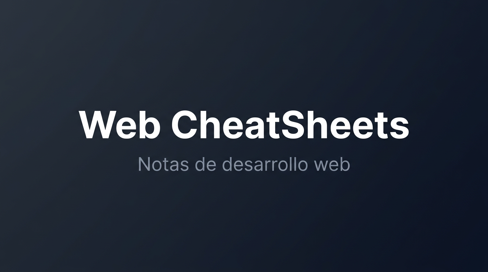

# Web CheatSheets

[](https://starlight.astro.build)



Web de notas personales de desarrollo web, siempre a la mano, para evitar tener que investigar o revisar documentación sobre temas que utilizo con frecuencia.

## Contenido

- **Chuletas**: Node, CSS (Tailwind), Git, TypeScript
- **Guías**: Manual personal, Vanilla + Tailwind + TypeScript
- **Borradores**: En desarrollo

## Comandos

| Comando           | Acción                          |
| ----------------- | ------------------------------- |
| `pnpm install`    | Instalar dependencias           |
| `pnpm dev`        | Servidor de desarrollo (4321)   |
| `pnpm build`      | Compilar para producción        |
| `pnpm preview`    | Previsualizar build localmente   |

## Estructura

```
├── public/              # Assets estáticos (screenshot.png para SEO)
├── src/content/docs/    # Documentación (chuletas, guías, borradores)
│   ├── cheatsheets/     # Node, CSS, Git, TypeScript
│   ├── guides/          # Manual, estructura proyecto, vanilla
│   └── drafts/
├── astro.config.mjs     # Configuración Starlight (temas, SEO, sidebar)
└── package.json
```

**Autor:** Fravelz
